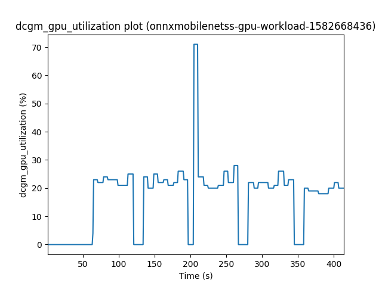
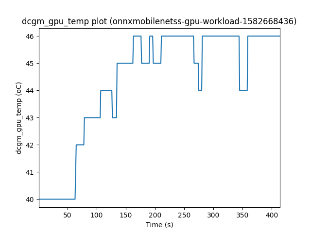
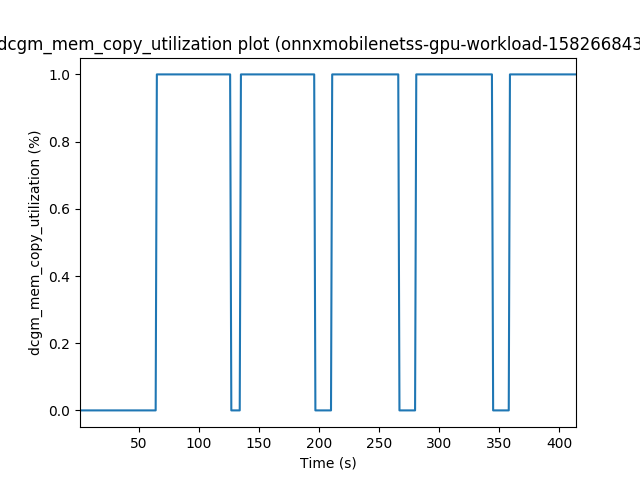
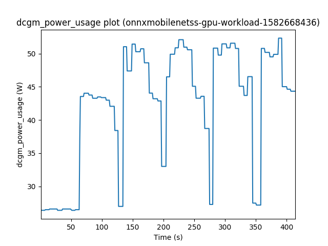

# Kubernetes GPU Scheduling

In this project we try to extend the GPU scheduling mechanism of Kubernetes.

In __system-setup__ folder the instructions of setting up the system I have used can be found.

We have created a GPU workload monitoring system. The *monitoring_script.sh* submits workloads to the Kubernetes cluster. While a workload is running, the script uses our *Go program* to get GPU metrics from Prometheus TSDB. When the workload is finished a *Python script* is used to plot the output metrics. Finally, the workload is deleted from the cluster.

> The container images that are used can be found in my [Dockerhub account](https://hub.docker.com/search?q=aferikoglou&type=image).

We have created a custom GPU scheduler. The custom-scheduler uses the default Kubernetes GPU extension. The GPU pods are scheduled based on priorities assigned by the scheduler.

## Getting Started

These instructions will get you a copy of the project on your local machine.

## Prerequisites

First of all the instructions in __system-setup__ folder must be followed.

The provided code is tested on the following OS.

* Ubuntu 16.04.5 LTS (GNU/Linux 4.4.0-173-generic x86_64)

It uses the following Go and Python versions.

* Go (1.11)
* Python (2.7.12)
	- [pandas 1.0.1](https://pypi.org/project/pandas/)
	- [matplotlib 3.1.3](https://pypi.org/project/matplotlib/)

## Setup

### Workload Monitoring System

After cloning the repository and building the Go program and librady, the right absolute paths for the *YAML_DIR_PATH*, the *GO_MONITORING_PROGRAM* and the *PYTHON_PLOTTING_PROGRAM* in *monitoring_script.sh* must be specified.

> In order to build the library, execute *go build* in *promqueriesutil* directory. After the library is built in order to build the monitoring program execute *go install* in *PrometheusHTTPRequests* directory.

### Custom Scheduler

/***** - *****/

## Usage

### Workload Monitoring System

```bash
./monitoring_script.sh
```

### Custom Scheduler

/***** - *****/

## Results

### Workload Monitoring System

Here we demonstrate the GPU utilization, temperature, mem-copy utilization and power usage *.png* for the *onnxmobilenetss-gpu-workload.yaml* file.

*GPU utilization*



*GPU temperature*



*GPU mem-copy utilization*



*GPU power usage*



### Custom Scheduler

/***** - *****/

## Author

* **Ferikoglou Aggelos**

This project was created through my *Diploma* in *[Microlab](https://microlab.ntua.gr/)*.

