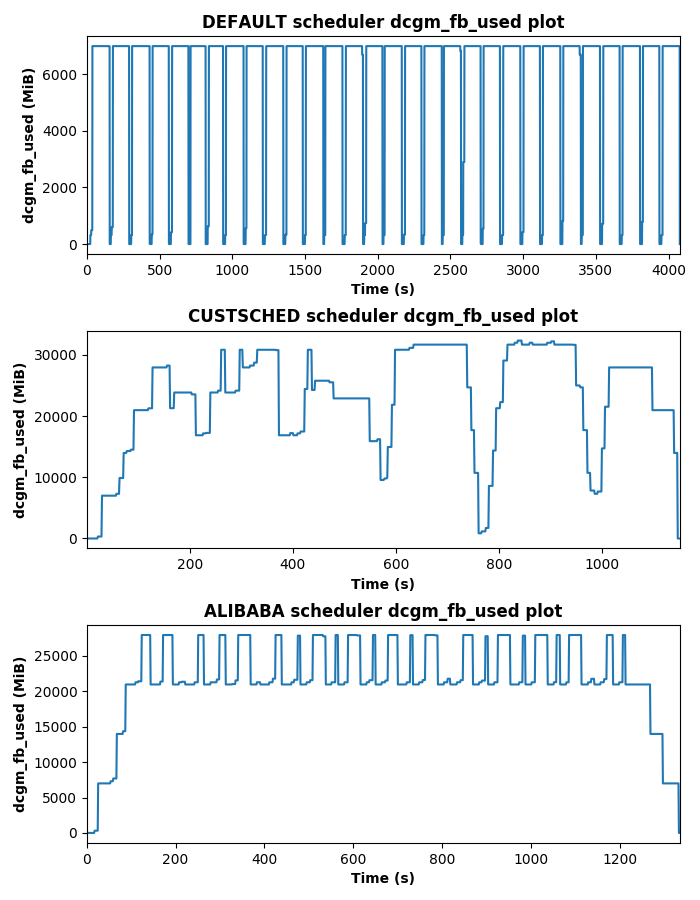

# Resource Aware GPU Scheduling in Kubernetes Infrastructure

In this project we tried to create a custom Kubernetes GPU scheduler based on [Kube-Knots](docs/papers/Kube-Knots.pdf) paper and compare it with the [official NVIDIA GPU device plugin](https://kubernetes.io/docs/tasks/manage-gpus/scheduling-gpus/) and the [Alibaba GPU sharing scheduler extender](https://www.alibabacloud.com/blog/gpu-sharing-scheduler-extender-now-supports-fine-grained-kubernetes-clusters_594926). The aim of our scheduler is to face the GPU memory over-provisioning problem by using real-time metrics from the used graphics card. We show that we can achieve better QoS and higher GPU resource utilization compared to the above mentioned schedulers, for a variety of ML cloud representative workloads.

The proposed system creates a workload based on a configuration file and feeds it in a specified rate to all the available schedulers using different memory over-provisioning percentages. For each experiment, metrics from the graphics card are exported (promqueriesutil package and prometheusGetter in go/src/github.com/aferikoglou must be built) and plotted. In addition, execution statistics for each Job of the workload are exported. These data are used for the comparison of the available schedulers concerning the QoS and the resource utilization.

More information for this project can be found in the detailed [report](docs/report/thesis_ferikoglou.pdf).

## Getting Started

These instructions will get you a copy of the project on your cluster.

## Used Versions of Required Software

### ALL cluster nodes

* Ubuntu 16.04.5
* Kubernetes 1.18.2
* Docker 19.03.8

### kube-master

* Python 2.7.12
* Golang 1.11

### kube-gpu

* NVIDIA-Docker 2.2.2

## Setup

In __system-setup__ folder the instructions of setting up the experimental infrastructure can be found.

## Usage

```bash
./runFullExperiment.sh
```

## Results

In __monitoring-files__ folder output data from our system can be found.

Here we demonstrate the dcgm\_fb\_used, dcgm\_gpu\_utilization and dcgm\_power\_usage signals for all the available schedulers, for over-provisioning percentages equal to 0%, 100% and 250%.

Solarized dark             |  Solarized Ocean
:-------------------------:|:-------------------------:
  |  

## Author

* **Ferikoglou Aggelos**

This project was created through my diploma in [Microlab](https://microlab.ntua.gr/).

