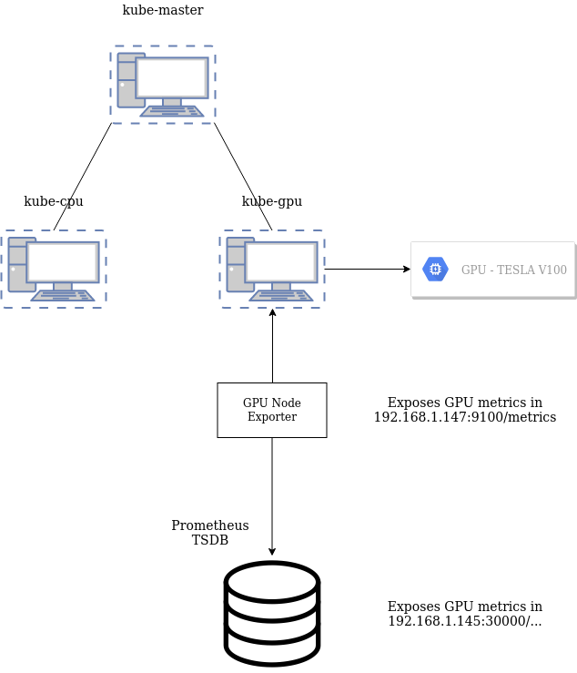

# System Setup

The system we have used consists of a Kubernetes cluster with three nodes:
- __kube-master__: admin node
- __kube-cpu__: node without GPU access
- __kube-gpu__: node with GPU access (NVIDIA TESLA V100)

We have enabled Kubernetes GPU support in order to use the GPU of kube-gpu node as an extendend resource (*default_sched_setup.md*).

We have also created a monitoring mechanism (GPU Node Exporter - Prometheus TSDB) in order to get GPU metrics and use them in our custom scheduler (*monitoring_system_setup.md*).

Finally, the results of our implementation are going to be compared with the [Alibaba GPU sharing scheduler](https://github.com/AliyunContainerService/gpushare-scheduler-extender) (*alibaba_sched_setup.md*).

The following image describes the system so far:

    

