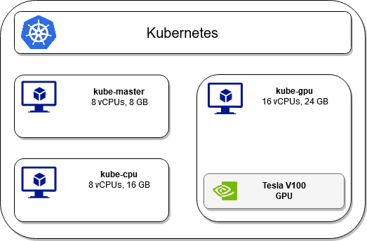

# System Setup

For the nodes of our cluster, we have deployed 3 virtual machines (VMs) (1 master node and 2 worker nodes) on top of the physical machines. The cores of these VMs range from 8 up to 16 and the RAM size from 8 GB up to 24GB. We used KVM as our hypervisor. One of the worker nodes has access to a NVIDIA TESLA V100 GPU. To simulate a cloud environment, all the referenced workloads running on the cluster have been containerized, utilizing the Docker platform. On top of the VMs, we have deployed Kubernetes as our container orchestrator.

The following image describes the above mentioned components.

    

The monitoring system we have used consists of the NVIDIA GPU Metrics Exporter and the Timeseries Database Prometheus. The GPU monitoring system can be set up following the instructions of [monitoring_system_setup.md](monitoring_system_setup.md).

The official NVIDIA GPU device plugin can be enabled following the instructions of [default_sched_setup.md](default_sched_setup.md) while the Alibaba GPU sharing scheduler extender can be enabled following the instructions of [alibaba_sched_setup.md](alibaba_sched_setup.md). Finally, our custom scheduler can be enabled following the instructions of [custom_sched_setup.md](custom_sched_setup.md).

The used workloads where created using image classification and object detection tasks from the [MLPerf Inference benchmark](https://mlperf.org/inference-overview/) suite. The container we created and used in our workloads can be found in this [Dockerhub account](https://hub.docker.com/search?q=aferikoglou&type=image).

After the initial system setup the setup.sh script can be used.
